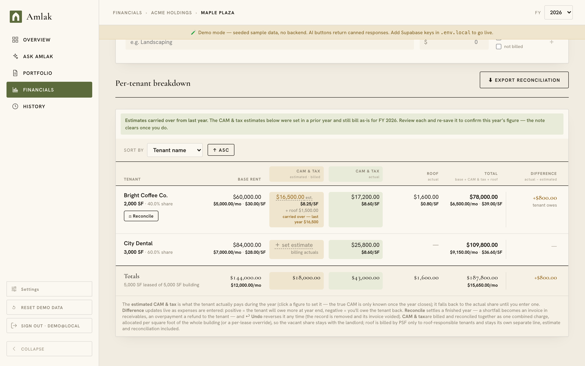
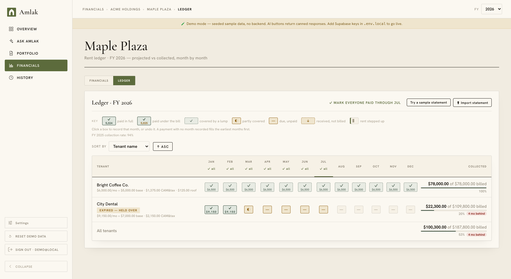
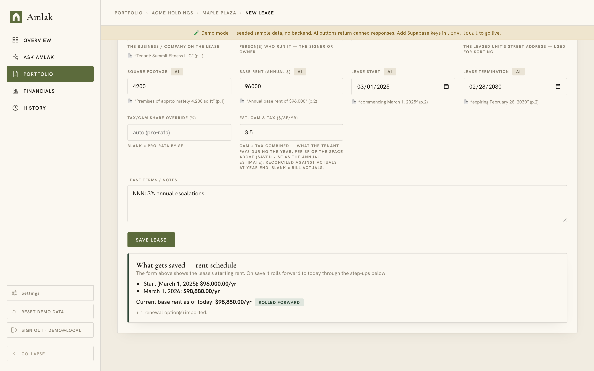
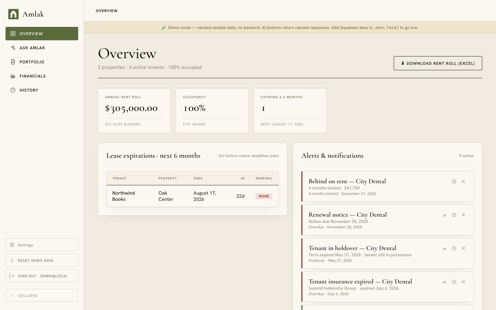

# Amlak

A property-management app for commercial landlords — leases, expense recovery, rent collection and
reminders in one place. It isn't a prototype: it runs a working portfolio day to day, across several
corporations and their tenants, with real rent ledgers and real CAM reconciliation.

**Live app:** [amlakre.com](https://amlakre.com) · **Demo sandbox:**
[amlak-demo.akkawigeo-5.workers.dev](https://amlak-demo.akkawigeo-5.workers.dev)

The demo needs no signup and no backend — it's the same bundle running against an in-memory mock
with seeded data. Every screen is clickable, the AI buttons return canned responses, and "Reset demo
data" puts it back. It's the fastest way to see what this does.

---

## Screenshots

All four are from the demo sandbox, so the tenants and figures are fabricated.

### Financials — what the tenant pays vs what the year actually cost



A commercial tenant pays an *estimated* CAM & tax charge all year, because the true cost isn't known
until the year closes. The gold column is what's being billed, the green column is that tenant's real
pro-rata share of expenses entered so far, and **Difference** is the live gap — here Bright Coffee
will owe another $800 at year end. **⚖ Reconcile** settles a finished year: a shortfall becomes an
invoice, an overpayment a refund, and **↩ Undo** reverses it later.

### Rent Ledger — projected vs collected, month by month



Every cell state at once: Bright Coffee paid one untagged $78,000 lump, so it fills Jan→Dec
first-in-first-out (dashed = covered by a lump). City Dental tagged January and February, came up
short in March (◐), and hasn't paid since — amber "—" months are due and unpaid, and the row is
flagged **4 mo behind**. City Dental's term also ended, so it carries an **expired — held over**
badge and keeps billing until it's removed.

### AI lease import — a form to check, not an answer to trust



The model fills the form and shows its work: an **AI** badge on each field it populated, and beneath
it the clause that field came from, with a page reference. Underneath, **What gets saved — rent
schedule** is built in code, not by the model: the lease's starting rent, each dated step-up, and the
rent that therefore applies today. Nothing is written until you press Save.

### Overview — what needs attention



Rent roll, occupancy and expiries on top. The alerts below are ordered by how soon each one bites and
colour-coded by severity; where there's someone to write to, the ✉ opens a letter drafted for that
exact situation.

---

## What it does

**Leases & documents.** Add a lease by hand, or upload the document — PDF, Word, a scan, a phone
photo — and have it read. Square footage, rent, term, escalation schedule, renewal options, free-rent
periods and tenant contacts come back as a form with confidence badges and source clauses. Addendums
and riders extract the same way and apply their changes on top: extend the term, change the rent, add
an option, assign the lease to a new tenant.

**Financials & expense recovery.** Enter property taxes, itemised CAM buckets and roof for a fiscal
year. The app allocates each per square foot of the **whole building**, so the vacant share stays
with the landlord instead of being spread over the remaining tenants. Revenue is computed from the
leases themselves — era-aware, so a past year reports the rent that actually applied then.

**Rent Ledger.** A 12-month grid per property. A payment tagged to a month settles that month; an
untagged lump pools and fills months forward. The Collected column reads *$X of $Y billed* with a
percentage and a months-behind badge.

**Bank-statement import.** Drop in a CSV export or a PDF statement. Every line is classified money-in
or money-out, deposits are matched to tenants by payee and corroborated against what they owe,
expenses are routed to a bucket, and duplicates are caught by line hash. It learns each payee the
first time you confirm it. Nothing is written until you press Save, and ↩ Undo reverses the whole
import.

**Reminders.** Lease endings, renewal notice deadlines, rent escalations, insurance and contract
expiry, annual-report filings, tenants behind on rent — as dashboard alerts and as a daily digest
email to the landlord. You choose how far ahead each type warns you. **Tenants are never emailed
automatically:** every letter opens in a compose window first.

**Ask Amlak.** Plain-English questions about your own records — *"which tenants have no insurance on
file?"*, *"who owes money?"* — answered from a compact facts-only summary of the account, with links
straight to each tenant named. Answers are cached against a portfolio fingerprint, so asking again
costs nothing until something actually changes.

**History & year-close.** A dated timeline per property (extensions, renewals, assignments,
reconciliations). Closing a fiscal year snapshots it — revenue, expenses, PSF rates, collection rate
— so later edits can't rewrite the historical record, and the trends chart reads those snapshots.

Also here: an insurance vault with expiry tracking and additional-insured checks; service contracts
that price themselves into CAM year over year; annual-report filing deadlines; Excel exports for the
rent roll and for a per-tenant reconciliation workbook; TOTP two-factor auth and a configurable auto
sign-out; and a settings switchboard that turns whole modules off — hiding a module also silences its
reminders, its emails, and its facts in Ask Amlak.

---

## How it fits together

**One data model.** Corporation → Property → Lease. The lease row is the single source of truth for
rent, term and square footage; three SQL views derive everything else from it:

| View | Derives |
|---|---|
| `v_tenant_shares` | each tenant's pro-rata tax / CAM / roof share, per year |
| `v_property_totals` | revenue, expenses, NOI, occupancy, vacant SF, $/SF rates |
| `v_invoice_balances` | what's billed, paid and outstanding |

So editing a lease — or an escalation applying on its own — cascades to revenue, PSF rates,
per-tenant shares, invoices and receivables with nothing re-entered. All three run with
`security_invoker`, so a view can never read past the caller's row-level security.

**The database keeps its own schedule.** Saving a lease, escalation or renewal regenerates that
lease's `key_dates` and `reminders` through triggers. Three pg_cron jobs run daily: `06:00` applies
due rent escalations and opens renewal-decision prompts, `06:15` runs an operator health check,
`13:00` sends the landlord's reminder digest. The same lifecycle also runs client-side once per day
per browser, so a lease is never stale just because cron missed a night.

**Closing a year freezes it.** A snapshot stores that year's revenue, expenses, PSF rates and
per-tenant collection figures. Historical reporting reads snapshots, not live rows.

---

## The rules this codebase holds itself to

These are the constraints worth arguing about, and they shape most of the design.

**1. Money math never runs through a model.** Every dollar figure — revenue, PSF, proration,
escalation compounding, abatement credit, invoices, reconciliation — is computed in plain JavaScript
or SQL. Where both need the same figure, the two implementations are mirrored and tested against each
other so they agree to the cent (`src/lib/abatement.js` ↔ the SQL `abatement_credit`;
`src/lib/leaseTerm.js` ↔ `effective_rent`).

**2. The model reads raw figures and a basis; code multiplies.** A lease might price rent as
`$12,595/month`, `$16.17/SF/year`, or a table by lease year. Asking a model to annualise it produces
figures that are *nearly* right — off by dollars, and wrong in ways that compound. So extraction
returns the number **exactly as printed** plus what kind of number it is, and
`rebuildRentSchedule` (`supabase/functions/_shared/rentSchedule.js`) does the arithmetic. It then
cross-checks its own result against the model's and raises `model_math_divergence` if they disagree
by more than ~0.25% or $5 — which has caught real misreads.

**3. Nothing writes without review.** Extraction pre-fills a form. A statement import books nothing
until Save. A reconciliation can be undone. No tenant is emailed without a human pressing send.

**4. Undo on every consequential action.** Reconciliation, statement imports, estimate changes,
expense edits, refunds — each is reversible, and the reversal restores the exact prior state rather
than approximating it.

**5. Honest failure beats a plausible lie.** A transcription chunk that fails leaves a visible
`[Pages 20-29 could not be read for search…]` marker in position rather than being quietly dropped —
a silent drop stitches the surviving chunks together into text that reads complete and isn't, which
is exactly how a lease once cached its last 21 pages and looked fine. In the same spirit, the
analyst read emits machine-readable verdicts that are compared against what the form actually
captured; when the strong reader saw a rent escalation and the form came back empty, the review
screen says so instead of showing nothing.

---

## The AI pipeline

Claude is used only for language: reading documents, answering questions about them, and writing the
trends narrative. The API key exists only as an edge-function secret and never reaches the browser.

**Getting text out of the document** — three paths, cheapest first:

- **Pasted text** — free.
- **Digital PDF or `.docx`** — the text layer is extracted server-side (`unpdf`, and a
  minimal `.docx` unzip). Free, instant, complete.
- **A scan or photo** — the file is uploaded **once** to the Anthropic Files API and referenced by
  `file_id` on every subsequent read. Inlining the bytes on each of three or four reads is what used
  to blow the edge function's memory and wall clock on a large scan.

**Reading it** — for leases, three stages:

1. **Analyst read** (Sonnet 4.6, unconstrained prose, 60 s box). No schema, so it can reason the way
   a person would about which clause governs and which is merely quoted. It ends with a
   machine-readable `VERDICTS:` line.
2. **Form fill** (Haiku 4.5) — the analyst's brief, the main structured call, a rent/contacts
   supplement and a full-text transcription all resolve in one `Promise.all`, 40 s per form attempt.
3. **Code** — annualise, rebuild the schedule, date the steps, compare against the analyst's
   verdicts, and hand a filled form to the review screen.

**Constraints that shaped it.** The whole request must finish inside the edge runtime's ~150 s wall
clock, so every call is individually time-boxed and the slow ones run concurrently rather than in
series. Long scans are transcribed in parallel 10-page chunks (up to 90 pages), each with its own
budget across retries. And Anthropic's structured output allows at most 16 union-typed parameters per
schema — the lease schema sits at 15 — so new fields are added as all-required array items, which
cost nothing against that ceiling.

**What things cost**

| Operation | Cost |
|---|---|
| Lease import — digital PDF / Word / pasted text | ~10–15¢ |
| Lease import — scanned document (adds vision + transcription) | ~25–35¢ |
| Addendum / rider | ~2–5¢ |
| Bank statement — **CSV** | **$0** — parsed and matched entirely in the browser |
| Bank statement — PDF (transcription only; matching is still code) | ~5–15¢ |
| Ask Amlak — new question / repeat | under ½¢ / **$0** (cached) |
| Manual entry, all financial math, every reminder | **$0** |

---

## Security

- **Row-level security on every data table**, two policies deep: `owner_all` scopes rows to their owner,
  and a restrictive `require_aal2` policy additionally requires a two-factor session. That second
  policy is written to be dormant until you enrol a factor (`aal2 OR not user_has_verified_mfa()`),
  so it can't lock anyone out of their own data, and `service_role` is unaffected so cron keeps
  running.
- **Real TOTP two-factor**, not a client-side flag — the gate reads the session's actual assurance
  level from Supabase Auth, so a valid password-only token can't reach the data through the REST API
  either. Plus a configurable idle auto sign-out.
- **Private document storage.** The `lease-documents` bucket is non-public, scoped per user by path,
  capped at 25 MiB, with allowed MIME types pinned at the storage API so HTML/SVG/executables are
  rejected before they exist.
- **Edge functions** verify the caller's JWT, enforce per-user rate limits (10/min on the document
  extractors, 30/min on the cheaper Q&A calls, 5/min on 2FA code sends) that log to a security-audit
  table, and answer CORS from an explicit allowlist that reflects localhost for development and never
  falls open to `*`.
- **No secret is in this repository.** Keys live in gitignored local env files and Supabase
  function secrets; the only key that ships in the bundle is the public `anon` publishable key,
  which is meaningless without RLS access.

---

## Testing

`npm test` runs **663 tests across 84 files** with Vitest and jsdom. No network, no API key, no AI
spend. The money and document-parsing logic is pure, so it's tested directly; everything above it
runs against the same in-memory mock the demo sandbox uses — which means the tests drive the real
components down the real code paths, not stand-ins for them.

What it actually pins:

- **The money math, mirrored.** JS and SQL implementations of the same figure are asserted equal to
  the cent, and invoices are asserted to reconcile exactly against the sum of their own months
  (`moneyCollection.test.js`, `ledger.test.js`, `reconciliation.test.js`).
- **Real leases, replayed for free.** Tests import
  `supabase/functions/_shared/rentSchedule.js` directly — the same module the edge function runs —
  and replay documents that previously extracted wrong: a $/SF-only rent table
  (`rentScheduleSqft.test.js`), an undated "Year 1 / Year 2" schedule
  (`relativeRentSchedule.test.js`), a rider that recites the clause it replaces
  (`supersededRider.test.js`), a lapsed renewal chain (`renewalChainReplay.test.js`).
- **Whole screens.** Render tests mount the real pages against the mock and drive them — the ledger
  grid, the statement-import review, the addendum review, the reconciliation flow
  (`ledgerPage.test.js`, `statementReviewSave.test.js`, `addendumReview.test.js`).
- **Named bugs, so they stay fixed.** A lease that printed "April 31, 2033" — a date that passes a
  regex *and* `new Date()`, which silently rolls it to May 1 (`extractionDates.test.js`); a malformed
  PostgREST filter that worked in the mock and 400'd against the live backend
  (`statementImport.test.js`); a $/SF rate rounded to the cent that no longer multiplies back to the
  rent above it (`psfRounding.test.js`). Each has a test that fails if the bug returns.

---

## Repo layout

```
src/
  pages/            19 route-level screens (Dashboard, Leases, Financials, Ledger, History, Ask…)
  components/       45 components — editors, modals, tables, review screens
  lib/              api.js is the only data layer; everything beside it is pure and unit-tested:
                      ledger.js            payment allocation, month components
                      leaseSchedule.js     term-aware per-month owed
                      abatement.js         free/reduced rent (mirrors the SQL)
                      reconciliation.js    estimated vs actual CAM & tax
                      statementParse.js    CSV/PDF statement normalisation
                      statementMatch.js    payee matching, rule learning
                      escalations.js       compounding, era-aware effective rent
                      alerts.js            what to warn about and when
                      portfolio.js         the facts summary Ask Amlak reads
    demo/           in-memory Supabase mock + seed — powers the demo AND the tests
supabase/
  functions/        19 Deno edge functions; _shared/ holds the Anthropic client, CORS,
                    rate limiting, PDF/DOCX handling, and the rent-schedule math
                    (shared verbatim with the test suite)
  migrations/       66 SQL migrations — schema, views, RLS, triggers, cron
docs/screenshots/   the images above
```

---

## Running it

**No setup at all:** open the [demo sandbox](https://amlak-demo.akkawigeo-5.workers.dev).

**Locally, in demo mode** — the default when no keys are present:

```bash
npm install
npm start          # Vite dev server on :3000
```

**Against a real Supabase project:**

```bash
supabase link
supabase db push                    # 66 migrations: schema, views, RLS, triggers, cron
supabase functions deploy           # all 19 edge functions
supabase functions deploy send-reminders --no-verify-jwt   # cron-invoked; authorised by
supabase functions deploy health-check   --no-verify-jwt   # the x-cron-secret header
```

```bash
supabase secrets set ANTHROPIC_API_KEY=sk-ant-...      # document reading + Q&A
supabase secrets set RESEND_API_KEY=...                # landlord reminder emails
supabase secrets set REMINDER_FROM_EMAIL=you@domain.com
supabase secrets set CRON_SECRET=<long-random-string>  # authorises the cron calls
supabase secrets set ALLOWED_ORIGINS=https://your-app-domain
supabase secrets set ADMIN_ALERT_EMAIL=you@domain.com  # health-check alerts
```

Then point the frontend at it:

```bash
cp .env.example .env.local
# REACT_APP_SUPABASE_URL, REACT_APP_SUPABASE_ANON_KEY
```

**Scripts**

| | |
|---|---|
| `npm start` | Vite dev server on :3000 |
| `npm run build` | production build → `./build` |
| `npm run preview` | serve a finished build |
| `npm test` | `vitest run` |
| `npm run test:watch` | `vitest` in watch mode |

**Deploying.** Two Cloudflare Workers from one codebase:

```bash
npm run build && npx wrangler deploy                       # live app → amlakre.com

npx vite build --config vite.demo.config.js --outDir build-demo
npx wrangler deploy -c wrangler.demo.jsonc                 # demo sandbox
```

The demo build points Vite at an empty env directory, so the bundle carries no credentials at all and
falls into demo mode by construction — it cannot reach the production backend even by accident.

---

## Notes

`main` is the deploy branch and deploys run locally through wrangler; there's no CI. Signup is capped
at two accounts while the app is in private beta. `CLAUDE.md` is the working log — standing
instructions plus a dated entry for every deployment, including what changed, what was verified, and
what was deliberately left alone.
